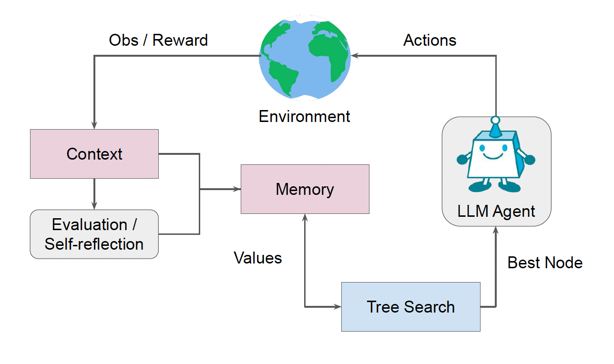

# Official Repo of Language Agent Tree Search (LATS) - ICML 2024

<p>
    <a href="https://www.python.org/">
        
    </a>
    <a href="https://copyright.illinois.edu/">
        
    </a>
</p>



Official implementation for ICML 2024 paper [Language Agent Tree Search Unifies Reasoning Acting and Planing in Language Models](https://arxiv.org/abs/2310.04406) with code, prompts, model outputs. 

More can be found at our [project website](https://lapisrocks.github.io/LanguageAgentTreeSearch/) or [paper](https://arxiv.org/abs/2310.04406)

Check out our demo, CodeLATS at our [demo](https://huggingface.co/spaces/AIatUIUC/CodeLATS/tree/main)

For a more general implementation for your AI applications, please look at the LangChain implementation in LangGraph.
[LATS-LangChain](https://github.com/langchain-ai/langgraph/tree/main/examples/lats) 

or the LlamaIndex implementation
[LATS-LlamaIndex](https://docs.llamaindex.ai/en/latest/api_reference/agent/lats/)


### Reasoning + Acting (HotPotQA)

#### Setup

To get started:

1. Clone this repo and move to the HotPotQA directory:
```bash
git clone https://github.com/andyz245/LanguageAgentTreeSearch && cd LanguageAgentTreeSearch/hotpot
```

2. Install the module dependencies into your environment:
```bash
pip install -r requirements.txt
```

3. Set `OPENAI_API_KEY` environment variable to your OpenAI API key:
```bash
export OPENAI_API_KEY=<your key>
```

4. Set the scripts and run paper experiments
```bash
sh lats.sh
```

- ``--n_generate_sample``: number of times to prompt during expansion/sampling
- ``--n_evaluate_sample``: number of times to prompt for state evaluation
- ``--iterations``: maximum number of trajectories to sample

### Reasoning (Programming)

#### Setup

To get started:

1. Clone this repo and move to the HotPotQA directory:
```bash
git clone https://github.com/andyz245/LanguageAgentTreeSearch && cd LanguageAgentTreeSearch/programming
```

2. Install the module dependencies into your environment:
```bash
pip install -r requirements.txt
```

3. Set `OPENAI_API_KEY` environment variable to your OpenAI API key:
```bash
export OPENAI_API_KEY=<your key>
```

4. Set the scripts and run paper experiments
```bash
sh run_lats.sh
```

Code adapted from https://github.com/noahshinn024/reflexion/tree/main

### Decision-making (WebShop)

#### Setup

To get started:

1. Clone this repo and move to the WebShop directory:
```bash
git clone https://github.com/andyz245/LanguageAgentTreeSearch && cd LanguageAgentTreeSearch/webshop
```

2. Install WebShop from source and run environment instance locally. Follow the instructions here (https://github.com/princeton-nlp/WebShop)

3. Install the module dependencies into your environment:
```bash
pip install -r requirements.txt
```

4. Set `OPENAI_API_KEY` environment variable to your OpenAI API key:
```bash
export OPENAI_API_KEY=<your key>
```

5. Change localhost in lats.py to your local port running WebShop

6. Set the scripts and run paper experiments
```bash
sh lats.sh
```

- ``--n_generate_sample``: number of times to prompt during expansion/sampling
- ``--n_evaluate_sample``: number of times to prompt for state evaluation
- ``--iterations``: maximum number of trajectories to sample

## Trajectories
``programming/root/`` contains all the trajectories from the paper's experiments on programming. Please use get_acc.py with the log path to get the actual accuracy. HotPotQA and WebShop logs were too large to upload, feel free to email if interested.

## Citations
Please cite the paper and star this repo if you use LATS and find it interesting. Feel free to contact andyz3@illinois.edu or open an issue if you have any questions.

```bibtex
@misc{zhou2023language,
      title={Language Agent Tree Search Unifies Reasoning Acting and Planning in Language Models}, 
      author={Andy Zhou and Kai Yan and Michal Shlapentokh-Rothman and Haohan Wang and Yu-Xiong Wang},
      year={2023},
      eprint={2310.04406},
      archivePrefix={arXiv},
      primaryClass={cs.AI}
}

```
