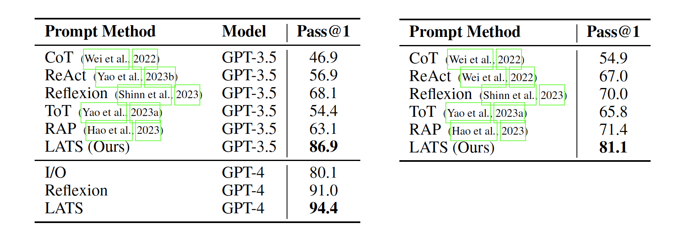

# Language Agent Tree Search Unifies Reasoning Acting and Planning in Language Models

[Paper](URL_FOR_PAPER)
[Code](https://github.com/andyz245/LanguageAgentTreeSearch)
[BibTex](URL_FOR_BIBTEX)


Language models can use reasoning and enhance acting for decision-making tasks (ReAct, Reflexion). Planning can also enhance reasoning through search (RAP, ToT). We show that through LATS, unifying reasoning, acting, and planning is the best approach for both reasoning and decision-making tasks.

## Abstract

While large language models (LLMs) have demonstrated impressive performance
on a range of decision-making tasks, they rely on simple acting processes and fall
short of broad deployment as autonomous agents. We introduce LATS (Language
Agent Tree Search), a general framework that synergizes the capabilities of LLMs
in planning, acting, and reasoning. Drawing inspiration from Monte Carlo tree
search in model-based reinforcement learning, LATS employs LLMs as agents,
value functions, and optimizers, repurposing their latent strengths for enhanced
decision-making. What is crucial in this method is the use of an environment for
external feedback, which offers a more deliberate and adaptive problem-solving
mechanism that moves beyond the limitations of existing techniques. Our experi-
mental evaluation across diverse domains, such as programming, HotPotQA, and
WebShop, illustrates the applicability of LATS for both reasoning and acting. In
particular, LATS achieves 94.4% for programming on HumanEval with GPT-4
and an average score of 75.9 for web browsing on WebShop, demonstrating the
effectiveness and generality of our method.



## QA Example


## Citations
Please cite the paper and star this repo if you use LATS and find it interesting/useful, thanks! Feel free to contact andyz3@illinois.edu or open an issue if you have any questions.

```bibtex

```
