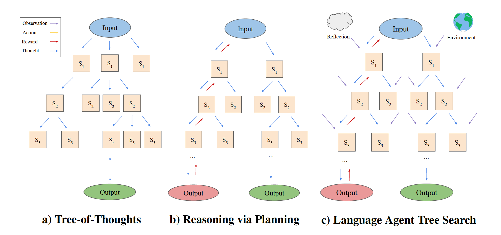
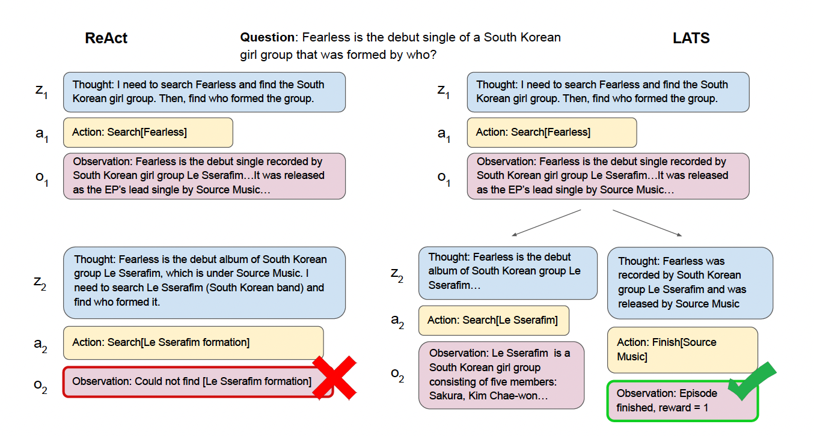

[Paper](https://arxiv.org/abs/2310.04406) | [Code](https://github.com/andyz245/LanguageAgentTreeSearch) | [Demo](https://huggingface.co/spaces/AIatUIUC/CodeLATS) 
  



# Language Agent Tree Search Unifies Reasoning Acting and Planning in Language Models

Language models can use reasoning and enhance acting for decision-making tasks (ReAct, Reflexion). Planning can also enhance reasoning through search (RAP, ToT). We show that through LATS, unifying reasoning, acting, and planning is the best approach for both reasoning and decision-making tasks.

  

## Abstract

  

While large language models (LLMs) have demonstrated impressive performance on a range of decision-making tasks, they rely on simple acting processes and fall short of broad deployment as autonomous agents. We introduce LATS (Language Agent Tree Search), a general framework that synergizes the capabilities of LLMs in planning, acting, and reasoning. Drawing inspiration from Monte Carlo tree search in model-based reinforcement learning, LATS employs LLMs as agents, value functions, and optimizers, repurposing their latent strengths for enhanced decision-making. What is crucial in this method is the use of an environment for external feedback, which offers a more deliberate and adaptive problem-solving mechanism that moves beyond the limitations of existing techniques. Our experimental evaluation across diverse domains, such as programming, HotPotQA, and WebShop, illustrates the applicability of LATS for both reasoning and acting. In particular, LATS achieves 94.4% for programming on HumanEval with GPT-4 and an average score of 75.9 for web browsing on WebShop with GPT-3.5, demonstrating the effectiveness and generality of our method.
  

## Results

  
  | Prompting Method          | HotpotQA (question answering, exact match) | HumanEval (programming, pass@1) | WebShop (web interaction, score) |
|---------------------------|---------------------------------------------------|-----------------------------------------------|----------------------------------------------|
| CoT                       | 0.34                                               | 46.9                                           | N/A (cannot act)                                          |
| ReAct                     | 0.32                                              | 56.9                                           | 53.8                                          |
| ToT                       | 0.55                                               | 54.4                                           | N/A (cannot act)                                           |
| Reflexion                 | 0.51                                               | 68.1                                           | 64.2                                          |
| LATS                      | 0.71                                               | 83.8                                           | 75.9                                          |


With GPT-3.5, LATS outperforms ReAct, Reflexion, CoT, ToT, and RAP across a variety of tasks, including programming and web-browsing.

  

## QA Example

  



  

LATS can sample many ReAct trajectories and construct the best one. This is done by deconstructing trajectories into states, which form the nodes of the tree. An LLM evaluates each state to guide the search algorithm.

  

## Citations

Please cite the paper and star this repo if you use LATS and find it interesting/useful, thanks! Feel free to contact andyz3@illinois.edu or open an issue if you have any questions.

  

```bibtex
@misc{zhou2023language,
      title={Language Agent Tree Search Unifies Reasoning Acting and Planning in Language Models}, 
      author={Andy Zhou and Kai Yan and Michal Shlapentokh-Rothman and Haohan Wang and Yu-Xiong Wang},
      year={2023},
      eprint={2310.04406},
      archivePrefix={arXiv},
      primaryClass={cs.AI}
}
```
